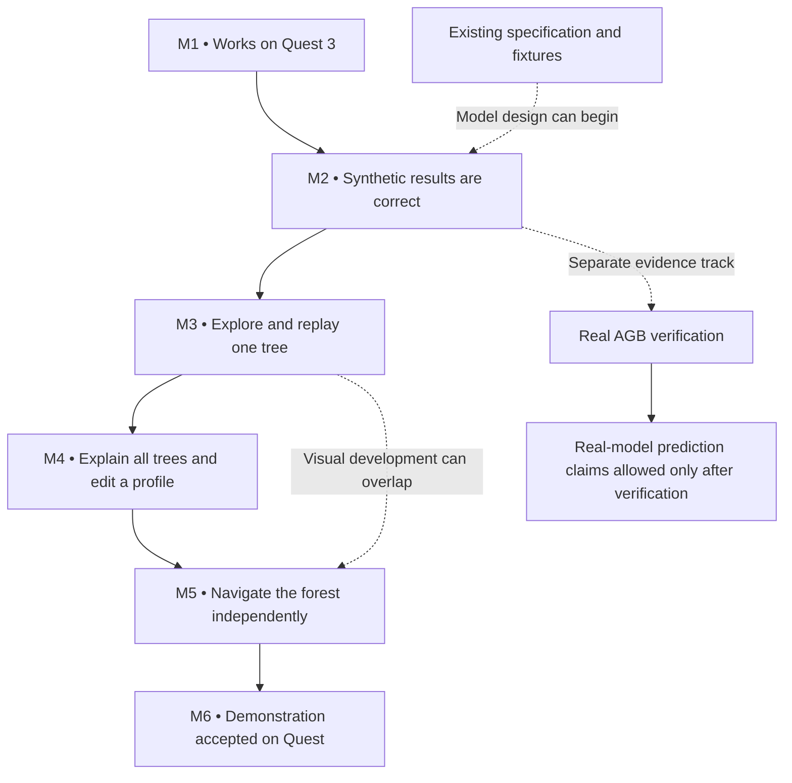
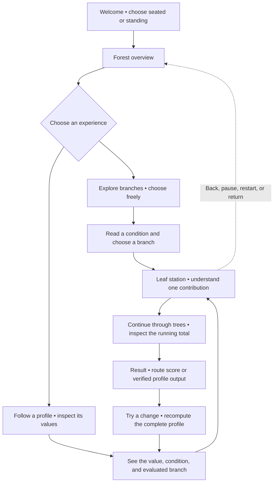

# Delivery backlog — M1 to M6

Updated: 2026-09-28. Planning baseline: [development plan](development-plan.md), [experience scenarios](experience-scenarios.md), [model contract](model-contract.md), [architecture](architecture.md), and [acceptance strategy](testing.md).

**Outcome:** a presenter can give a reliable, understandable standalone Quest 3 demonstration of how a boosted-tree model reaches an outcome. Visitors can both choose branches themselves and follow a prepared synthetic profile. These are equally required experiences.

**Current position:** D07 scope cleanup and D10 source/build checkpoint are complete for the starting configuration. The user requested deferring the remaining checks to main development; M1 headset acceptance remains open. See the [checkpoint and deferred-check list](configuration-checkpoint-2026-09-28.md). M2-01–M2-05 are implemented and verified by 84 passing Unity EditMode tests; see the [M2 evidence record](m2-foundation-2026-09-28.md). This completes the synthetic logic gate in the Editor, not M1 device qualification or real AGB verification. M2-06–M2-08 and M3–M6 remain open. M3 source implementation is in progress; [Unity import and verification are pending](m3-progress-2026-09-28.md).

This backlog contains **six epics and 48 user stories**. Acceptance criteria are proposed delivery requirements, not test results. Story ownership identifies a role; no person has been assigned. Estimates remain the original milestone planning ranges, not commitments derived from story count.

## Business roadmap

| Epic | Business outcome | Stories | Starting status | Planning range |
| --- | --- | --- | --- | --- |
| [M1 — A dependable first headset experience](backlog/m1-headset-foundation.md) | A visitor can put on Quest 3 and select an object in an app that works without the Mac. | M1-01–M1-09 | Partially configured; not accepted | 1–2 working days |
| [M2 — Results that can be explained and trusted](backlog/m2-model-trust.md) | Every shown route and contribution has a repeatable, checkable meaning. | M2-01–M2-08 | Synthetic foundation implemented; 84 EditMode tests pass; real-model track open | 3–5 days for synthetic contract; real-model verification depends on evidence |
| [M3 — Understand one tree by exploring it](backlog/m3-one-tree.md) | A first-time visitor understands a fork, a leaf contribution, and undo in one small forest clearing. | M3-01–M3-08 | In progress; scene generation and Unity verification pending | 4–6 days |
| [M4 — Explain the complete prediction and try a change](backlog/m4-ensemble.md) | A visitor sees how all trees contribute and how a hypothetical profile edit changes the result. | M4-01–M4-08 | Not started | 4–6 days |
| [M5 — Navigate an understandable forest](backlog/m5-forest-experience.md) | Visitors move between overview and detail without losing their place or needing keyboard help. | M5-01–M5-07 | Not started | 4–6 days |
| [M6 — A demonstration ready for an audience](backlog/m6-demo-readiness.md) | The presenter receives a tested, comfortable, reproducible headset build and clear operating instructions. | M6-01–M6-08 | Not started | 4–6 days |

The development plan allows roughly 5–8 working weeks including integration contingency. Account approval, hardware availability, learning time, external assets, distribution review, and source-model clarification are outside those estimates. Do not schedule dates from this document without team estimation.

The main arrows show acceptance dependencies, not a rule that every developer must wait to begin design work. Missing real AGB evidence must not block the synthetic demonstration; it blocks claims about real predictions.

## Visitor journey

The return arrow is a navigation shortcut, not an automatic restart. Returning to the forest retains the session. Manual branch choices are labeled as exploration; they do not automatically become a customer prediction.

## How to use the stories

Each story contains a business user statement, suggested accountable role, priority, current status, dependencies, detailed acceptance criteria, and required evidence. Story IDs remain stable if the wording changes. Record implementation tasks and estimates underneath the relevant story during planning.

- **Must:** required to accept the relevant epic and deliver the stated demonstration.
- **Conditional:** required only when its stated feature or data scope is selected. Its prerequisite cannot be silently assumed.
- **Partially configured:** some settings or tools exist; the story's acceptance evidence is incomplete.
- **Implemented / EditMode verified:** the scoped C# behavior has passing automated evidence; device and scene dependencies remain separately tracked.
- **Not started:** no accepted implementation evidence was found during the review.
- **Blocked externally:** the team needs a device, account action, trusted reference data, or another explicitly identified external input.

A dependency naming another story means that story's relevant accepted output is required. M0 refers to the existing repository foundation. Unless stated otherwise, stories in M3–M6 use bundled synthetic data and must preserve both interaction modes.

## Shared definition of done

1. Acceptance criteria pass with evidence appropriate to the behavior: independent logic tests, deterministic PlayMode checks, and actual Quest tests where tracking, comfort, readability, or performance matter.
2. No open issue prevents the epic's stated business outcome. Known non-blocking issues have an owner, impact, and documented workaround; “not tested” is never a pass.
3. English copy explains the user's task. Color is supported by text or shape, controls remain reachable, and a seated visitor is considered.
4. Evaluator and session state remain independent of scene geometry, head tracking, locomotion, and animation. Presentation limits never remove trees from evaluation.
5. Manual route scores, synthetic profile predictions, and verified real-model predictions have distinct meaning and labeling. No probability is inferred from gain, sample count, root score, or arbitrary manual choices.
6. Tracked fixtures are synthetic. Real profiles/exports, device identifiers, signing material, and detailed device logs stay out of tracked documentation and ordinary Git history.
7. Relevant documentation reflects the actual tested state. Assets retain their Unity-generated `.meta` files. Verified package/settings changes are recorded together in the agreed repository.
8. The epic leaves a runnable Quest scene once M1 is accepted. Later desktop checks supplement, rather than replace, the affected device checks.

## Setup findings mapped to delivery work

This table uses the refreshed live snapshot, approximately 18:46 UTC on 2026-09-27. Concurrent work resolved several initial setup gaps; configured stories still require their acceptance evidence.

| Finding | Current evidence/status | Backlog destination |
| --- | --- | --- |
| Project location and repository ownership | Resolved: keep `BoostingExperience/` in parent repository; history/work backed up and original history imported | M1-01; accepted device checkpoint remains in M1-09 |
| Unity baseline | User accepted 6000.6.3f1; build/install passed; runtime compatibility remains unverified | M1-02 |
| Android Build Support and bundled SDK/NDK/JDK | Now installed; paths verified | Qualify through M1-02, M1-08 |
| URP pipeline and Linear color | Now active as `Quest_URP` | Device checks in M1-03 |
| Meta Core/Interaction SDKs | Now installed at 207.0.0 | Scope/compatibility checks in M1-04 |
| Android OpenXR and validation | Now enabled; no OpenXR issues or Required Meta task failures found | Device checks in M1-04, M1-08 |
| Active target/player settings | Android, IL2CPP/ARM64, API 32–34, Vulkan, prototype ID; successful development APK confirms compile SDK 34 | Permissions scope/runtime acceptance in M1-05, M1-08 |
| Input handling Both blocked Android build | User switched to Input System Package (New); second build succeeded | Runtime checks remain in M1-04, M1-08 |
| XR simulation singleton warning; historical Touch-profile fix failures | Two runtime settings assets remain; D06 deferred to main development by user request | M1-04, M1-08 |
| Comprehensive rig and broad XR features | D07 configured: inactive hand/locomotion branches retained for reuse; optional AR/SpaceWarp off; Quest 3-only APK with unused permissions removed | Runtime checks deferred in M1-04–M1-06; product navigation still required in M3–M5 |
| Saved smoke scene and build list | Now present; no missing scripts; feedback/readability untested on device | M1-06, M1-08 |
| Connected Quest | Follow-up at 19:05 UTC: Quest 3 authorized over USB; device queries succeed | M1-07; runtime checks remain in M1-08 |
| APK build/update installation | Previous build installed September 27; cleaned-up APK built September 28, not installed/run. Further checks deferred | M1-08 |
| Toolchain qualification and repository checkpoint | D10 source/build record complete; exact commit, APK hash and final manifest recorded. Device qualification/reproduction deferred | M1-09 |
| Checker project-path detection | Corrected to `BoostingExperience/`; real-project pass and explicit missing-project failure verified | M1-01 |
| Test Framework | 1.8.0 direct dependency; 84 project EditMode tests pass on 2026-09-28 | M2 and later behavioral stories |
| Optional Meta Platform recommendations | Conditional DUC/app-ID tasks; no Platform SDK registered | Revisit M1-04 only if Platform API scope is added |
| Simulator | Not found in standard locations; optional | Optional aid within M1-04 |
| Model/session/tree experience | Synthetic model foundation implemented and EditMode verified; session and tree experience remain open | M2–M5 |
| Hardware performance, recovery, soak, comprehension | No accepted evidence | M6-01–M6-08 |

See the [setup review](setup-review-2026-09-27.md) for D01–D12, installed versions, warnings, and evidence limits. Account/license suitability, host qualification, and final merged-APK behavior remain unverified. At 19:05 UTC the user confirmed Developer Mode and the follow-up verified authorized Quest 3 USB debugging.

## Acceptance gates

| Gate | Required demonstration | Evidence owner |
| --- | --- | --- |
| G1 — M1 | Install, track head/controllers, select, disconnect Mac, relaunch standalone | Unity/XR developer + Quest tester |
| G2 — M2 synthetic | All fixed paths, leaves, weighted contributions, raw scores, probabilities, and invalid-input cases match independent expectations | Model developer + reviewer |
| G2R — real-data claim | Supported source export agrees with trusted source predictions and branch evidence; unresolved semantics are closed | Model owner + model developer |
| G3 — M3 | Visitor takes two routes, undoes safely, replays a profile, and explains the leaf contribution on Quest | UX/QA tester |
| G4 — M4 | Full ensemble reconciles in both modes; profile edits replace stale state; short and detailed tours agree | Model + Unity/XR reviewers |
| G5 — M5 | Visitor selects, enters, inspects, and returns using controllers, with readable labels and retained progress | UX/QA tester |
| G6 — M6 | Blocking acceptance matrix passes; release performance evidence and 30-minute soak recorded; three new users observed; presenter package reproducible | Release owner |

## Decisions to resolve

| Decision | Starting position | Needed by |
| --- | --- | --- |
| Canonical project name/location and repository ownership | Decided 2026-09-28: retain `BoostingExperience/`; one parent repository; preserve earlier history | Resolved D03 |
| Editor baseline | Decided 2026-09-28: retain Unity 6000.6.3f1; finish runtime qualification | D04 choice resolved; testing remains in M1-02 |
| Exact Meta package combination | Follow official declared dependencies; pin the combination actually tested | M1-04 |
| Device/account availability | Quest 3 USB authorization verified; remaining account/controller/MQDH checks not automatically accepted | M1-07 |
| Real-model demonstration scope | Synthetic-only until G2R passes | M2-07, M2-08 |
| Readability/comfort test positions and worst visible scene | Define measurable scenarios before final testing | M3-08, M5-03, M6-01 |
| Casting | Conditional; choose whether the live demonstration requires it | M6-06 |
| Distribution | Local USB APK installation; external/store distribution is a separate decision | M6-07 |

## Scope boundaries

This backlog implements M1–M6, not every scenario in the reference material. Full predictor search/fireflies, heuristic audit overlays, recorded multi-stop tours, live multi-user review, two simultaneous profile paths, hand tracking, continuous riding, and learning-history terrain remain deferred. Basic prepared-profile playback, a single editable profile copy, forest overview, and selected-tree navigation are in scope. A hypothetical edit illustrates model sensitivity, not causality.
