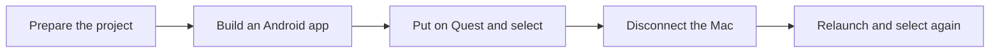

# Epic M1 — A dependable first headset experience

[Backlog overview](../backlog.md) · [Setup evidence](../setup-review-2026-09-27.md)

**Business description.** Before investing in the forest experience, prove that a visitor can put on Quest 3, look around naturally, point at an object, and select it. The application must keep working when the Mac is disconnected. This milestone removes uncertainty about whether the development tools, headset, and chosen interaction technology work together.

**Business value:** a repeatable starting point for every later demonstration, with fewer surprises during feature development.

**Status:** configuration checkpoint recorded; headset acceptance deferred to main development at the user's request. **Priority:** Must. **Dependencies:** M0, appropriate Unity/Meta accounts, Quest 3, controllers, and a USB data cable. **Suggested accountable role:** Unity/XR developer. **Planning range:** 1–2 working days excluding external delays and baseline reconciliation.

**In scope:** canonical project/repository, Android toolchain, URP, Meta/OpenXR, one interaction scene, first APK, independent relaunch, and evidence. **Outside this epic:** tree evaluation, forest gameplay, store distribution, and performance acceptance.

**Epic acceptance:** the same recorded build passes tracked head/controller input and selection before and after disconnection. Exact versions and limitations are recorded, and verified project assets/settings are reproducible from the agreed repository.

## M1-01 — Establish one clear project and repository

**User story:** As a project maintainer, I want one agreed project location with recoverable version history so that everyone opens and changes the same application.

**Priority:** Must. **Status:** Repository structure resolved on 2026-09-28; canonical path and parent ownership established, history/work preserved, checker verified. Fresh-checkout reproduction remains pending. **Owner role:** Project maintainer. **Depends on:** M0.

**Acceptance criteria**

1. Retain the user-selected `BoostingExperience/` location and `VRExperienceAGB` product name (decision 2026-09-28). Keep opening instructions and all affected documentation consistent.
2. Before restructuring the nested repository, preserve its current commit and uncommitted/untracked work in a recoverable form. Do not discard the user's asset or configuration changes.
3. Establish the guide's single repository ownership, or explicitly document an approved alternative. A parent checkout must not accidentally contain only a Git reference that omits the actual project files.
4. After reconciliation, open the canonical project in its recorded Editor and verify that package references and `.meta` identities still resolve.
5. Update the prerequisite checker to locate the canonical project and its pinned Editor. A missing project must produce a truthful message; ambiguity between projects must not silently select one.
6. Detect or explicitly document MQDH's bundled ADB and distinguish it from Unity's required Android SDK/NDK/JDK. Finding ADB alone must not imply Android Build Support is installed.

**Evidence required:** before/after repository ownership and recovery record, successful canonical-project open, and checker outputs for the real project and a deliberately missing path. No history deletion is needed merely to prepare this story for review.

## M1-02 — Prepare a qualified Mac development toolchain

**User story:** As a developer supporting the presenter, I want a documented Editor and Android toolchain so that I can build the headset application consistently.

**Priority:** Must. **Status:** Partially configured; Android modules now installed, baseline/device qualification pending. **Owner role:** Unity developer. **Depends on:** M1-01.

**Acceptance criteria**

1. Use installed Unity 6000.6.3f1, accepted by the user on 2026-09-28 in place of the original 6.3 LTS proposal. Record Apple Silicon architecture, host OS, and runtime compatibility evidence still to be proven on device.
2. Install Android Build Support, Android SDK & NDK Tools, and OpenJDK for that exact Editor. The Editor must report Android builds supported.
3. Unity's External Tools settings resolve the intended bundled SDK, NDK, and JDK. Record their actual versions; do not substitute MQDH's ADB for the missing build toolchain.
4. Confirm the license permits the required local build. Any sign-in or license action requiring the account owner is identified without storing account identifiers or credentials in the repository.
5. Retain the working VS Code selection, supported Visual Studio Editor package, and Unity/C# extensions. Demonstrate opening a C# script and obtaining useful completion/diagnostics.
6. If an Editor change is needed, use a recoverable, deliberate migration path. Do not downgrade the existing project in place or claim success merely because Hub lists an installation.

**Evidence required:** Editor/module inventory, resolved tool paths/version record, script-editing check, and later successful M1-08 APK build. Installation alone is partial completion.

## M1-03 — Activate the intended rendering pipeline

**User story:** As a visitor, I want a consistent visual foundation that can run on Quest so that the forest can be built with readable, predictable materials and lighting.

**Priority:** Must. **Status:** Partially configured; Quest URP and Linear now active, device verification pending. **Owner role:** Unity rendering developer. **Depends on:** M1-02.

**Acceptance criteria**

1. Create the appropriate URP pipeline and renderer assets through Unity. Assign the intended pipeline in Graphics and every applicable quality override, including the Android quality selection.
2. Confirm the live scene uses URP; a package entry or global-settings asset is not sufficient evidence of activation.
3. Set the intended Linear color configuration subject to the installed SDK's validation. Record any justified deviation rather than silently retaining Gamma.
4. Verify the smoke-test floor, label, and selectable object's materials render correctly without missing shaders or unintended pink/error materials.
5. Keep the initial scene and effects small enough for an early device smoke test. Do not add expensive decoration to disguise a missing rendering configuration.
6. Save Unity-generated assets with their `.meta` files and document which pipeline/renderer is used by the tested APK.

**Evidence required:** live pipeline identity, saved asset assignments, material inspection, and a headset image/check in M1-08. Performance acceptance remains in M6.

## M1-04 — Install and configure the Quest interaction stack

**User story:** As a visitor, I want my headset and controllers to drive one consistent interaction system so that pointing and selecting behave predictably.

**Priority:** Must. **Status:** D07 scope configuration completed and Android required checks clear; duplicate-settings diagnostics and runtime behavior deferred. **Owner role:** XR developer. **Depends on:** M1-02, M1-03.

**Acceptance criteria**

1. Install compatible official Meta XR Core and Interaction SDK packages and their declared dependencies. Record exact resolved versions without forcing unrelated components to share a version number.
2. Enable OpenXR for Android/Meta Quest and the matching Meta features and controller interaction profile. Verify an Android loader actually exists and initializes.
3. Use one tracked rig and one controller selection stack from matching samples/Building Blocks. Do not add a competing interaction stack to work around missing setup.
4. Configure the Input System as required by that stack. The user replaced Both with Input System Package (New), clearing the Android build blocker; retain this verified correction and complete controller checks.
5. Run Unity/OpenXR and Meta project validation for Android. Record required failures, apply justified fixes, and rerun until required failures are resolved.
6. Never treat a validator that skipped an unconfigured Android loader as a pass. Recheck the previously captured XR settings import warning after assets settle.
7. Review unused hand, locomotion, passthrough, scene/anchor/mesh, colocation, and space-warp capabilities introduced by broad SDK defaults. Disable them or document their purpose; verify the resulting permissions and stable-observer behavior.
8. If a Simulator is used, document its separate desktop runtime/graphics setup. Its absence or failure must not delay the USB APK route.

**Evidence required:** registered package inventory, Android loader/features record, required-validation results, and rig/controller selection proof from M1-08.

## M1-05 — Configure the standalone prototype build

**User story:** As a presenter, I want the correct application built for standalone Quest 3 so that installing it does not depend on desktop streaming.

**Priority:** Must. **Status:** D07 APK built; identity, ARM64, Quest 3 declaration and final permissions verified. New APK deployment/runtime acceptance deferred. **Owner role:** Unity build developer. **Depends on:** M1-02–M1-04.

**Acceptance criteria**

1. Select the Android or Meta Quest build target/profile. Verify the resulting build is an APK, not the current macOS player.
2. Preserve IL2CPP and ARM64; verify ARMv7 is disabled. Record the applied settings in the actual build configuration.
3. Set the agreed product name and local prototype identifier, initially `com.vrexperienceagb.prototype` unless the project owner deliberately chooses another. Replace the accidental DefaultCompany identifier.
4. Resolve Android API settings against current installed SDK and Meta requirements. The guide's initial 32/34 values are a starting point; record minimum, target, and compile API actually used.
5. Resolve and record Android graphics APIs/render mode through project validation; do not copy a Simulator desktop setting blindly. Confirm the selected rendering/color settings are used by Android.
6. Use a Development Build for diagnosis and enable script debugging only when needed. Keep signing material outside Git and avoid permissions unrelated to the offline experience. Review the source manifest's current hand-tracking permission and device list broader than Quest 3, then verify the merged APK manifest.
7. Include the saved M1-06 scene in the active profile's build list before building. A build with an empty scene list does not satisfy this story.

**Evidence required:** target/profile and player-settings record, generated APK identity, relevant build log, and review of the generated manifest. Scene inclusion is verified with M1-06.

## M1-06 — Create a minimal, understandable interaction scene

**User story:** As a first-time visitor, I want a simple scene with an obvious target so that I can immediately tell whether looking, pointing, and selection work.

**Priority:** Must. **Status:** Partially configured; saved rig/floor/label/ray-grabbable-cube scene present; device behavior unverified. **Owner role:** XR developer. **Depends on:** M1-03, M1-04.

**Acceptance criteria**

1. Save a scene containing the selected tracked rig, floor, readable world-space English instruction, and a large selectable object.
2. The rig uses actual head/controller tracking. Looking around remains independent of scene animations and object movement.
3. Pointing at the object gives visible hover/target feedback; selection gives unmistakable confirmation. Both controllers are checked.
4. Target placement and label size permit seated and standing use without requiring a visitor to walk outside their safe play space.
5. Missing controller input or an unavailable runtime produces a diagnosable condition, not a false successful selection.
6. Include the saved scene in the intended build profile and retain all generated `.meta` files. Reopening the scene preserves its rig, references, and interaction behavior.

**Evidence required:** saved scene/build-list inspection and a short on-device selection record. This scene is a foundation test, not the one-tree experience.

## M1-07 — Connect and authorize the test headset

**User story:** As a tester, I want an authorized Quest 3 connection so that I can install the prototype and inspect failures without guessing whether the device is reachable.

**Priority:** Must. **Status:** USB detection/authorization verified at 19:05 UTC; Quest 3 device build recorded. MQDH UI, charged-controller readiness, and remaining criteria are not yet accepted. **Owner role:** Device/account owner with XR tester. **Depends on:** M1-02; hardware and account prerequisites.

**Acceptance criteria**

1. A Quest 3, charged controllers, and USB data cable are available. Confirm the account's developer prerequisites and device Developer Mode with the account owner.
2. The headset appears in MQDH and ADB as an authorized device. When authorization is pending, the tester receives the specific instruction to accept the in-headset debugging prompt.
3. No-device, unauthorized, and connected states are distinguished. A working ADB executable with an empty device list is not a successful connection.
4. Record the headset OS version for qualification while keeping device serial/account identifiers out of tracked documentation.
5. Prefer direct USB for the first deployment and resolve cable/port conflicts before attributing failures to application code.
6. If several devices are connected, choose the intended Quest explicitly. Do not deploy to an arbitrary first device.

**Evidence required:** sanitized device state, recorded OS version, and successful target selection for M1-08.

## M1-08 — Prove the app works independently on Quest

**User story:** As a presenter, I want the same simple interaction to work before and after disconnecting the Mac so that I know the demonstration is truly standalone.

**Priority:** Must. **Status:** Deferred to main development. The September 27 build was installed; the changed D07 APK built on September 28 has not been installed/run. Launch/tracking/selection/relaunch remain untested. **Owner role:** XR tester. **Depends on:** M1-05–M1-07.

**Acceptance criteria**

1. Build and install the smoke-test APK under ignored `artifacts/builds/`; capture actual build/deployment failures and resolve them before marking a pass.
2. The app launches in immersive VR with the intended scene. It does not merely appear as a flat Android panel.
3. Looking around updates the tracked pose; each controller points at and selects the object with the expected visible response.
4. Disconnect the Mac, exit the app, and relaunch it from the headset. Repeat the tracking and selection checks successfully.
5. Relaunch with network connectivity unavailable to confirm the bundled smoke-test content needs no runtime service.
6. A failed install/signature mismatch is diagnosed without automatically uninstalling and losing device data. Any required destructive recovery is a separate decision.
7. Record pass/fail/not-tested separately for build, launch, head tracking, controller tracking, selection, and independent relaunch.

**Evidence required:** APK/version identity, sanitized build/device logs, dated manual checklist, and local video/screenshots where useful. Editor compilation or a Simulator session cannot substitute for these results.

## M1-09 — Preserve the verified foundation

**User story:** As a future developer or presenter, I want a reproducible checkpoint and honest setup record so that I can rebuild the working foundation and understand its limits.

**Priority:** Must. **Status:** D10 configuration record completed: source commit, package/settings/asset hashes, APK identity and manifest evidence preserved. Accepted device results and fresh-checkout reproduction are deferred, so the full story remains unaccepted. **Owner role:** Project maintainer. **Depends on:** M1-01, M1-08.

**Acceptance criteria**

1. Update `docs/toolchain.md` with exact Editor/package/SDK/NDK/JDK versions, host OS, Android APIs, graphics/render mode, headset OS, build type, and tested outcomes.
2. Preserve Force Text and Visible Meta Files; pair every tracked asset with its Unity-generated metadata.
3. Commit verified package manifest, package lock, project settings, assets, and `.meta` files together in the agreed repository. Confirm generated caches/builds, signing files, and private data remain ignored.
4. Reopen or reproduce from the recorded checkpoint and verify package resolution and scene references; record what was reproduced and any remaining machine-specific prerequisites.
5. Update setup/development/testing status to show M1 accepted only after device evidence exists. Distinguish installed, configured, built, and tested states.
6. Record unresolved non-blocking limitations, including host compatibility evidence or optional Simulator status. Do not record device serials or account identifiers.

**Evidence required:** checkpoint identifier, clean asset-reference/package review, reproducibility check, and completed M1 configuration record. No remote publication is implied.

## Development-plan coverage

| Original M1 item | Stories |
| --- | --- |
| Hub, Editor and Android modules | M1-02 |
| OpenXR and Meta Core/Interaction | M1-04 |
| Universal 3D project at agreed location | M1-01, M1-03 |
| Validation and Android ARM64 player | M1-04, M1-05 |
| Rig, floor, label and selectable object | M1-06 |
| APK build, install and run | M1-07, M1-08 |
| Head/controller tracking and selection | M1-06, M1-08 |
| Standalone relaunch | M1-08 |
| Exact configuration record | M1-09 |
| Commit verified settings/packages/assets | M1-09 |
