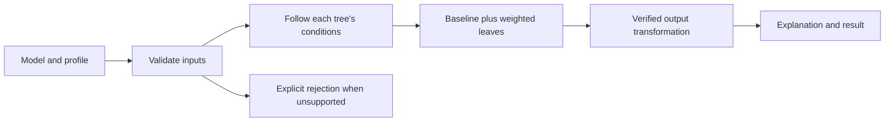

# Epic M2 — Results that can be explained and trusted

[Backlog overview](../backlog.md) · [Model contract](../model-contract.md)

**Business description.** Give the demonstration a trustworthy explanation engine. When a visitor follows a profile, every branch should be determined by a stated value and condition, every leaf should contribute the correct amount, and the final result should reconcile with all trees. A beautiful scene must never make an unsupported model result appear authoritative.

**Business value:** the presenter can explain why a result appears and identify the boundary between a synthetic example and a verified real prediction.

**Status:** not started in C#; Python synthetic fixtures pass. **Priority:** Must for the synthetic contract; real-data claims are conditional. **Dependencies:** M0; M1 for C# qualification. **Owner role:** Model developer with model-owner review. **Planning range:** 3–5 days for the internal contract; external verification has no committed duration.

**Epic acceptance:** the normalized C# evaluator matches all independent synthetic expectations and fails clearly on invalid inputs. Real-model support has a separate evidence-backed status. A real-data dependency cannot be waived by passing synthetic tests.

## M2-01 — Represent models and profiles consistently

**User story:** As a presenter, I want the same model and profile to mean the same thing throughout the experience so that a change of view cannot change the explanation.

**Priority:** Must. **Status:** Not started. **Owner role:** Model developer. **Depends on:** M0; M1-09 for accepted Unity execution.

**Acceptance criteria**

1. Implement plain C# model/profile/result types carrying schema version, model ID, provenance, named outcome, baseline, feature definitions, ordered trees, weights, stable node IDs, and split/leaf data.
2. Preserve exact internal identifiers independently of readable display names. Repeated feature names or similar labels must not merge distinct identities.
3. Model evaluation requires no GameObject, transform, camera, scene loading, animation, or headset runtime. Tests can instantiate and evaluate data without those dependencies.
4. Represent an explicit missing value separately from a value not yet supplied during manual profile construction.
5. Returned results include visited node IDs, selected leaf, effective contribution per tree, raw score, probability where supported, and explicit diagnostics.
6. Session/profile copies cannot accidentally mutate the original fixture or another visitor's evaluation result.

**Evidence required:** C# type/API review, construction/round-trip cases for the supplied fixture, and an independent test assembly showing the evaluator runs without XR scene dependencies. Assembly boundaries must serve real isolation rather than empty scaffolding.

## M2-02 — Reject incomplete or malformed data clearly

**User story:** As a presenter, I want invalid models and profiles rejected with useful explanations so that I do not demonstrate a plausible but incorrect result.

**Priority:** Must. **Status:** Not started. **Owner role:** Model developer. **Depends on:** M2-01.

**Acceptance criteria**

1. Reject unsupported schema versions, incompatible model/profile IDs, duplicate IDs, missing/invalid roots, invalid child references, cycles, and trees with no valid terminal route.
2. Reject unknown operators, incompatible feature types, invalid categories, disallowed missing values, and non-finite numeric values before a result is presented.
3. Validate baseline, weights, and leaf values as finite; missing mandatory scoring semantics must not be filled with guessed defaults.
4. Identify the offending model/tree/node/feature and reason without leaking private profile contents into tracked logs.
5. A failed tree or profile invalidates the prediction as a whole. Do not return a partial ensemble as a successful result.
6. Retain the last valid session only under an explicit visible policy; an invalid import must not leave an old result appearing to describe the new input.

**Evidence required:** independently authored invalid-input cases for every rejection class, clear error payloads, and proof that invalid input cannot produce a successful prediction object.

## M2-03 — Evaluate each supported decision exactly

**User story:** As a visitor, I want a profile's branch choice explained by its actual value so that I can understand and verify every decision.

**Priority:** Must. **Status:** Not started. **Owner role:** Model developer. **Depends on:** M2-02.

**Acceptance criteria**

1. Numeric `lt` means strictly less-than. Values below, equal to, and above the threshold take the expected branches; equality goes false.
2. Categorical `in` uses exact case-sensitive membership in the declared domain. Unknown categories are rejected instead of silently assigned to the false branch.
3. `is_missing` recognizes absent or explicit null values only under the feature's declared missing policy. A missing numeric operand must not become zero or an ordinary false result.
4. Evaluate the same profile independently through every tree. The running ensemble score is never injected as a feature unless a verified model contract explicitly requires it.
5. Return the entire visited path and chosen leaf in deterministic order; repeated evaluation of identical data yields identical paths and values.
6. Expose the feature value, condition, and Boolean outcome needed by the presentation without asking the scene to repeat the scoring logic.

**Evidence required:** boundary, membership, case-sensitivity, absent/null, and incompatible-input tests with fixed expected paths, including the supplied boundary profile.

## M2-04 — Reconcile the full score and output

**User story:** As a business viewer, I want the final output reconciled to the baseline and every tree's contribution so that I can see where the number comes from.

**Priority:** Must. **Status:** Not started. **Owner role:** Model developer. **Depends on:** M2-03.

**Acceptance criteria**

1. For synthetic contract v1, calculate `baseScore + sum(tree.weight * reachedLeaf.score)` across every tree exactly once.
2. Preserve baseline and leaf/contribution values separately. Neither gain, sample count, root score, nor display size is used to infer an individual prediction.
3. Use a numerically stable sigmoid for the synthetic binary-logistic objective. Test large positive/negative scores without overflow or NaN.
4. Declare numeric comparison tolerances independently of display rounding. A rounded percentage must not feed back into subsequent scoring.
5. Include non-unit and zero weights, negative/positive contributions, and a larger synthetic ensemble in tests, beyond the supplied all-unit-weight fixture.
6. Hidden geometry, selected tree, tour length, render budget, and display order do not change the full-model result. Preserve canonical tree order in the explanation record.
7. Unsupported real-model objectives/links/calibration remain rejected or unverified; the synthetic formula is not automatically applied to them.

**Evidence required:** independent hand-calculated score cases, numerical stability tests, and identical full results with several presentation selections/budgets.

## M2-05 — Match the independent synthetic reference cases

**User story:** As a reviewer, I want fixed reference cases that prove the Unity evaluator's behavior so that future changes cannot quietly alter the demonstration's meaning.

**Priority:** Must. **Status:** Not started in C#; Python reference checks pass. **Owner role:** Model developer and independent reviewer. **Depends on:** M2-03, M2-04.

**Acceptance criteria**

1. Load the tracked model/profiles and compare every path, leaf, effective contribution, raw score, and probability with `expected-predictions.json`.
2. Verify raw scores for new, returning, engaged, and boundary profiles are respectively -2.2, -0.7, -0.1, and -1.0 within declared tolerance.
3. The boundary profile with previous responses 5 and lifetime value 100 follows the false branches of both strict less-than tests.
4. Expected values remain independent fixtures; do not regenerate expected answers from the implementation under test.
5. Run meaningful EditMode tests in the pinned Editor and preserve the result report. Add rejection, weight, missing-value, and stability cases beyond the four happy paths.
6. A regression identifies the profile/tree/node or quantity that differs. Update expectations only after contract review, never simply to make a test pass.

**Evidence required:** passing Unity test report and reviewed expected fixtures. Mark the synthetic gate passed separately from real AGB verification.

## M2-06 — Import supported AGB exports without guessing

**User story:** As a model owner, I want supported exports normalized with transparent limitations so that unsupported split syntax cannot be mistaken for a correct prediction.

**Priority:** Must for the planned adapter; real-model usage remains conditional on M2-08. **Status:** Not started. **Owner role:** Import/model developer. **Depends on:** M2-01–M2-04 and representative export grammar evidence.

**Acceptance criteria**

1. Define the supported export versions/structure and map tree/node/feature identities to the normalized contract while retaining original split text for diagnostics.
2. Parse only explicitly supported numeric, membership, and missing-value syntax, including verified escaping and branch conventions.
3. Reject unknown or ambiguous grammar and missing scoring semantics. Never treat every split as numeric or infer a baseline from success rate/root scores.
4. Validate all trees, preserve the complete ensemble, and report unsupported constructs with their locations. No renderer-driven tree cap or silent partial import is allowed.
5. Keep the adapter separate from scene objects and from the normalized evaluator, so parsing errors can be reproduced without VR.
6. Use synthetic representative exports in tracked tests. Approved real exports remain under ignored `data/private/` unless separately cleared for sharing.

**Evidence required:** supported-format statement, independent parser/negative tests, and examples of actionable rejection diagnostics. Import success alone must not be labeled real scoring verification.

## M2-07 — Obtain authoritative source-model evidence

**User story:** As a business sponsor, I want the assumptions behind real predictions confirmed by the model owner so that the presentation does not overstate its accuracy.

**Priority:** Conditional for real-data claims; required work item in the plan. **Status:** Blocked externally pending source evidence. **Owner role:** Model owner with model developer. **Depends on:** agreed real-model scope; can begin alongside M2-01.

**Acceptance criteria**

1. Obtain an approved model export and representative profiles with trusted full predictions and, where available, visited leaves/paths.
2. Cover strict boundaries, membership, missing values, and ordinary profiles that distinguish competing interpretations of the source semantics.
3. Confirm whether baseline is explicit or encoded in a tree, whether leaf values already include learning rate, and whether additional weighting applies.
4. Confirm feature preparation/derived-feature rules, categorical escaping, branch direction, output link, calibration, tree order, and whether all trees contribute.
5. Record source/version/provenance and unresolved questions. Missing path evidence or incomplete documentation remains a visible limitation, not an inferred answer.
6. Store sensitive inputs and detailed predictions locally under `data/private/`; keep only non-sensitive verification summaries in tracked documents.

**Evidence required:** model-owner clarification record, approved local reference set, and an explicit list of which semantic questions are resolved. No dates or approvals are fabricated.

## M2-08 — Gate real prediction claims on demonstrated agreement

**User story:** As a presenter, I want a clear supported/verified status for each imported model so that I know which results I may describe as source-model predictions.

**Priority:** Conditional for real-data claims. **Status:** Not started; M2-07 is an external dependency. **Owner role:** Model developer and model owner. **Depends on:** M2-05–M2-07.

**Acceptance criteria**

1. Compare supported imported models with trusted references using agreed numerical tolerances and exact branch/leaf matches where reference paths exist.
2. Investigate every mismatch in baseline, weight, path, feature preparation, or transformation; do not add an unexplained correction factor to force agreement.
3. A model receives verified status only for the formats, operators, feature preparation, and output semantics actually covered by evidence.
4. Unsupported/unverified models cannot display an unqualified source-model probability. The presenter sees a clear reason and can return to the synthetic demo.
5. Passing synthetic tests never changes real-model verification status. The synthetic implementation path to M3 remains available while source questions are unresolved.
6. Pin the accepted source/evaluator versions and rerun the affected comparisons when parsing or scoring semantics change.

**Evidence required:** reconciliation report, unresolved-issue disposition, reviewed support matrix, and a reproducible acceptance record without private inputs committed.

## Development-plan coverage

| Original M2 item | Stories |
| --- | --- |
| Plain C# model/profile types | M2-01 |
| Structural/type/value validation | M2-02 |
| Deterministic paths, contributions, baseline, output | M2-03, M2-04 |
| Match synthetic fixtures | M2-05 |
| Numeric, categorical, missing operators | M2-03 |
| Fail-closed AGB adapter | M2-06 |
| Trusted predictions and paths | M2-07 |
| Confirm baseline/scaling/missing/calibration | M2-07 |
| Resolve discrepancies before real prediction claims | M2-08 |
