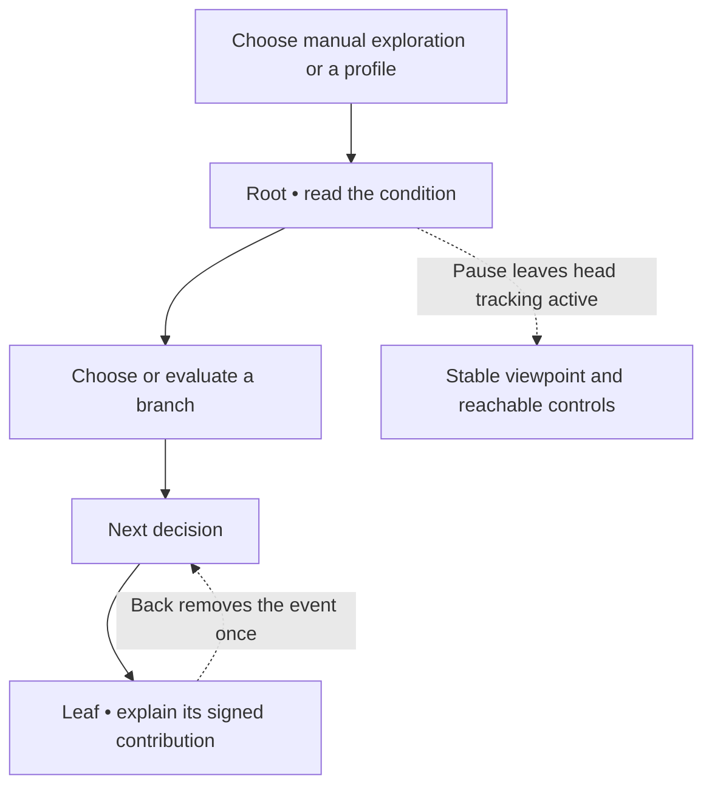

# Epic M3 — Understand one tree by exploring it

[Backlog overview](../backlog.md) · [Visitor scenarios S01–S02](../experience-scenarios.md)

**Business description.** Turn one decision tree into a small place a visitor can understand. A luminous drop arrives at a fork, a readable condition explains the choice, and a leaf shows how that route changes the score. Visitors first choose freely, then watch a prepared profile follow the same tree. They can undo and try again without losing control or corrupting the result.

**Business value:** prove the core teaching moment before expanding to a whole forest.

**Status:** In progress: session, presentation, scene-generator and test sources written. Unity import/scene generation and Editor/PlayMode verification are blocked by the TMP package trust dialog; see the [progress record](../m3-progress-2026-09-28.md). No M3 story is accepted. **Priority:** Must. **Dependencies:** accepted M1 and M2's synthetic contract; real AGB verification is not required. **Owner role:** Unity/XR developer with UX tester. **Planning range:** 4–6 working days.

**Epic acceptance:** on Quest, a visitor can take two different routes, reach and undo a leaf, replay a prepared profile, and explain the contribution. Seated and standing checks pass; repeated input never duplicates scoring.

## M3-01 — Build a readable seven-node tree

**User story:** As a first-time visitor, I want one small tree laid out clearly so that I can understand where a decision begins, which branches follow it, and where a route ends.

**Priority:** Must. **Status:** Not started. **Owner role:** Unity presentation developer. **Depends on:** M1-09, M2-01, M2-05.

**Acceptance criteria**

1. Render all seven nodes of the first synthetic tree with correct stable IDs, split/leaf types, and parent-child relationships.
2. Include a root entry, stable split platforms, labeled outgoing branches, leaf contribution stations, and the luminous data-drop actor.
3. Both branch labels state their actual conditions; direction/color alone cannot carry the meaning. The displayed feature names correspond to the model's identifiers.
4. Keep the initial clearing compact and visually coherent, with readable depth and no need to climb or hold an extreme upward gaze.
5. A view rebuild or re-entry restores node identity without generating scoring events. Decorative trees are visibly distinct from model-bearing geometry.
6. The scene is saved, included in the runnable build, and has no missing references or materials under the chosen URP configuration.

**Evidence required:** model-to-node mapping check, PlayMode scene inspection, and Quest screenshots/readability notes. Counts or layout inferred from an unrelated reference export are insufficient.

## M3-02 — Point, select, and inspect with confidence

**User story:** As a visitor using controllers, I want obvious pointing and selection feedback so that I know which branch or node I am about to choose.

**Priority:** Must. **Status:** Not started. **Owner role:** XR interaction developer. **Depends on:** M3-01, M1-04.

**Acceptance criteria**

1. Controller rays distinguish available, hovered, and selected targets using visible cues plus text/shape where needed.
2. A selection produces one session command associated with the intended model ID, even when trigger input repeats or a target is briefly lost and reacquired.
3. Target colliders support comfortable selection without requiring the label itself to be a tiny hit area. Both controllers can perform the core action.
4. Node inspection stays stable long enough to read the condition and related information; the panel does not chase the user's gaze or obscure the next action.
5. Add a short haptic response where supported, with visible confirmation sufficient when haptics are absent.
6. Controls remain responsive during data-drop movement; input is processed or clearly unavailable according to an explicit state, never silently queued into duplicate choices.

**Evidence required:** repeated-input and wrong-target prevention checks, controller parity checklist, and on-headset target/inspection observation.

## M3-03 — Explore branches without pretending to predict a customer

**User story:** As a curious visitor, I want to choose either branch without first completing a profile so that I can explore how different routes reach different leaves.

**Priority:** Must. **Status:** Not started. **Owner role:** Application/session developer. **Depends on:** M3-02, M2-03, M2-04.

**Acceptance criteria**

1. “Explore branches” starts a clearly labeled manual session and allows a deliberate choice at each available split without requiring a complete customer profile.
2. Store the ordered route with stable tree/node/decision IDs; visual movement reflects the accepted session state rather than determining it.
3. On reaching a leaf, commit one signed contribution and show the previous total, contribution, and new total with clear meaning.
4. Merely hovering, looking at, re-rendering, or re-entering a leaf does not commit another contribution.
5. Label manual output as a route score; do not display it as an individual probability based on arbitrary choices. Whole-ensemble consistency handling is added in M4-06.
6. Repeated selection during a transition cannot skip a decision, traverse both children, or add a leaf twice.

**Evidence required:** deterministic session tests for two paths and repeated input, plus a headset run demonstrating selection-to-score agreement.

## M3-04 — Undo, restart, and pause without losing trust

**User story:** As a visitor, I want to go back, pause, or restart safely so that I can learn by trying alternatives without worrying that the score is wrong.

**Priority:** Must. **Status:** Not started. **Owner role:** Application/session developer. **Depends on:** M3-03.

**Acceptance criteria**

1. “Back” restores the preceding decision state and reverses a committed leaf event exactly once. Repeated Back at the root is a safe no-op with understandable feedback.
2. Choosing a different branch after undo replaces the abandoned route's current state without retaining its contribution.
3. Pause stops presentation advancement and further automatic decisions while head/controller tracking remains active. Resuming continues from the accepted state.
4. Restart clears this session's decisions and committed contributions and restores the documented baseline/start state.
5. Back, Pause, Restart, and Return to forest remain reachable; Return preserves progress until an explicit restart. Before the M5 diorama exists, use a clear entry/overview return point.
6. Requests during movement are handled deterministically; interruption does not leave the drop, highlighted route, and score describing different states.

**Evidence required:** command-sequence tests for repeated undo/restart, PlayMode pause/interruption checks, and on-device control reachability.

## M3-05 — Follow a prepared profile step by step

**User story:** As a business viewer, I want to see a prepared profile's value beside each condition so that I understand why the model follows one branch rather than the other.

**Priority:** Must. **Status:** Not started. **Owner role:** Application/presentation developer. **Depends on:** M2-05, M3-01, M3-02, M3-04.

**Acceptance criteria**

1. “Follow a profile” shows the selected synthetic profile's name and values before starting, validates it against the model, and visibly identifies the mode.
2. At each split, show the human-readable feature, exact condition, profile value or explicit missing state, and evaluation result.
3. Step, Play, Pause, Resume, Replay, and Previous decision navigate the evaluator's deterministic route without repeating scoring logic in the scene.
4. Replay of unchanged data yields the same path, leaf, and contribution. Stepping backward/forward and repeated input cannot duplicate contribution events.
5. The display distinguishes this one-tree contribution from a completed ensemble output. A one-tree teaching scene must not present a partial sum as the full three-tree prediction.
6. Choosing an arbitrary alternative branch changes to visibly labeled manual exploration rather than silently mutating the prepared profile.

**Evidence required:** fixture-to-visible-route comparisons for the four profiles, including the threshold boundary, PlayMode playback tests, and a Quest replay check.

## M3-06 — Keep the viewer comfortable while the drop moves

**User story:** As a seated or standing visitor, I want the data drop to move while my viewpoint stays under my control so that the explanation does not force uncomfortable head motion.

**Priority:** Must. **Status:** Not started. **Owner role:** XR developer. **Depends on:** M3-03–M3-05.

**Acceptance criteria**

1. Head position/orientation remain driven by tracking independently of drop animation, branch transitions, and playback state.
2. Do not introduce forced yaw, head bob, camera shake, surprise acceleration, or automatic continuous riding.
3. Default to a stable observer position; any movement between observation points is deliberate, clearly signaled, and stoppable through the documented controls.
4. The visitor can read the next decision without following the drop physically, walking out of the safe play space, or reaching an inaccessible control.
5. Pausing/backtracking during movement leaves the viewer in a stable pose with consistent route state.
6. Seated and standing users can reach the same actions; a seated choice adjusts presentation/control placement without scaling the tracking space.

**Evidence required:** review of camera/rig ownership and device observations in both use postures. Record discomfort reports and adjust before accepting the vertical slice.

## M3-07 — Explain the current state with clear, persistent copy

**User story:** As a visitor unfamiliar with machine learning, I want to know where I am and what the score means so that I can follow the experience without a presenter translating every screen.

**Priority:** Must. **Status:** Not started. **Owner role:** UX/presentation developer. **Depends on:** M3-03, M3-05.

**Acceptance criteria**

1. Show current mode, tree identity, current condition, and appropriately labeled score/contribution without covering branch targets.
2. Explain baseline and signed contribution in plain English; the sign indicates whether the leaf adds to or subtracts from the raw total.
3. Keep a stable panel available instead of relying solely on wrist orientation. Core status and controls remain readable from intended observation points.
4. Use readable contrast and consistent text/shape labels alongside color. Glow and decorative motion do not carry essential meaning or obscure text.
5. At a leaf, distinguish previous total, this tree's contribution, and resulting total; on undo, update all related values consistently.
6. Avoid calling a manual route a customer prediction or a partial tree score a full probability. Synthetic content is identified as an example.

**Evidence required:** copy/semantic review and a first-user explanation check on Quest, with observed confusion recorded as defects.

## M3-08 — Accept the complete one-tree learning loop

**User story:** As a product owner, I want the full loop proven by a visitor on the headset so that the next milestone expands something understandable and reliable.

**Priority:** Must. **Status:** Not started. **Owner role:** UX/QA tester. **Depends on:** M3-01–M3-07.

**Acceptance criteria**

1. On Quest, complete two distinct manual routes, reach a leaf, undo, choose an alternative, and verify no duplicate contribution.
2. Run a prepared profile using step and automatic playback, pause/resume, return to an earlier decision, and replay with the expected route.
3. Repeat the core checks seated and standing using controller input without keyboard intervention.
4. Ask the visitor why the total changed and why the prepared profile chose a branch; record their actual explanation and observed assistance.
5. Stress repeated trigger input and Back/Restart during animations; route highlights, selected node, drop position, and score stay consistent.
6. Record the build/version, profile, posture, expected/actual outcomes, and remaining issues. Resolve blockers before calling the slice accepted.

**Evidence required:** dated device checklist and concise comprehension observation. This early check does not replace M6's three-person study or full acceptance matrix.

## Development-plan coverage

| Original M3 item | Stories |
| --- | --- |
| Seven-node tree and clearing | M3-01 |
| Platforms, labels, leaf stations, drop | M3-01 |
| Pointing, feedback and inspection | M3-02 |
| Manual mode, commitment, undo, restart, pause | M3-03, M3-04 |
| Prepared stepping and automatic playback | M3-05 |
| Tracking independent of animation | M3-06 |
| Mode/tree/condition/score display | M3-07 |
| Seated and standing full-loop verification | M3-08 |
