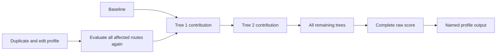

# Epic M4 — Explain the complete prediction and try a change

[Backlog overview](../backlog.md) · [Model contract](../model-contract.md)

**Business description.** Expand the lesson from one tree to the full model. Visitors see that a prediction begins with a baseline and accumulates contributions from every tree. They can take a short explanation or inspect more detail, then duplicate a prepared profile and try a hypothetical change. Both routes must tell the same numerical story.

**Business value:** connect the immersive journey to the complete model result, while making the limits of free exploration and hypothetical edits explicit.

**Status:** preliminary ensemble navigation and profile editing implemented in the M3 development branch; remaining M4 acceptance work is next. See the [handoff](../development-progress-2026-09-29.md). **Priority:** Must. **Dependencies:** accepted M3 and M2 synthetic evaluator. **Owner role:** Application developer with model reviewer. **Planning range:** 4–6 working days.

A short tour groups some explanations; it does not omit their contributions. Manual exploration remains a route score unless a consistent profile and verified scoring semantics support a prediction.

**Epic acceptance:** both modes work across the ensemble; all displayed totals reconcile; edits clear stale state; contradictions are explained; short and detailed tours produce identical full results.

## M4-01 — Show every tree's contribution to the total

**User story:** As a business viewer, I want to reconcile the final result with the baseline and each tree so that I can understand the ensemble as a series of contributions.

**Priority:** Must. **Status:** Not started. **Owner role:** Model/presentation developer. **Depends on:** M2-04, M2-05, M3-08.

**Acceptance criteria**

1. Evaluate all three synthetic trees for a selected profile and expose baseline, ordered per-tree contributions, complete raw score, and named output.
2. Presentation uses the evaluator's result record; hidden trees, current focus, and skipped animations cannot change the computation.
3. Distinguish a currently presented running total from the already computed complete prediction. The display makes clear which contributions have been explained so far.
4. Manual sessions accumulate committed route events with the appropriate labels; visiting the next tree never commits the previous leaf again.
5. A larger synthetic ensemble exercises the same complete-evaluation behavior beyond the initial three trees, including when rendering detail is limited.
6. The displayed ledger and final result reconcile with the independently specified fixture and declared numeric tolerances.

**Evidence required:** full-ensemble fixture comparison, ledger reconciliation, and tests with different visibility/tour selections and a larger synthetic model.

## M4-02 — Move deliberately between trees and reach a meaningful result

**User story:** As a visitor, I want clear transitions and a final explanation so that I understand how individual trees connect to the overall outcome.

**Priority:** Must. **Status:** Not started. **Owner role:** Unity/XR presentation developer. **Depends on:** M4-01, M3-06.

**Acceptance criteria**

1. Show current tree position in canonical boosting order and an explicit action or clearly signaled playback step to continue to the next tree.
2. Inter-tree transitions preserve profile, mode, contribution history, and pause state. They do not rotate or animate the tracked head.
3. The final station distinguishes raw score from the output transformation and names the outcome represented by a supported profile probability.
4. Manual/free exploration reaches a route-score explanation without an unqualified customer probability.
5. The visitor can return to a previous decision/tree and revise it; all later affected presentation and contribution state is invalidated or recomputed consistently.
6. Repeated Next/Back at first/last boundaries is safe and cannot create phantom trees or duplicate leaf events.

**Evidence required:** end-to-end PlayMode session checks and headset transitions in both modes, including Back across a tree boundary.

## M4-03 — Choose and switch prepared profiles safely

**User story:** As a presenter, I want visitors to inspect and select a prepared example so that they know whose hypothetical values the explanation follows.

**Priority:** Must. **Status:** Not started. **Owner role:** Application/UX developer. **Depends on:** M4-01, M3-05.

**Acceptance criteria**

1. Offer the four bundled synthetic profiles with stable names/identities, readable values, and a visible synthetic-data explanation.
2. Validate model/profile compatibility before playback and show useful errors instead of launching an invalid route.
3. Switching profiles cancels old playback and replaces route highlights, leaf contributions, score displays, and selected-result state together.
4. The chosen profile's identity stays visible throughout the tour. Reopening selection does not accidentally reset the session until another choice or restart is accepted.
5. Replay of the same original profile starts from the documented state and reproduces the independent expected result.
6. Input arriving while a switch is being applied cannot mix two profiles' trees or contributions.

**Evidence required:** profile-switch tests at root, mid-animation, leaf, and final station, plus a controller-only selection run.

## M4-04 — Create a safe hypothetical profile edit

**User story:** As a business viewer, I want to try changing an allowed feature while preserving the original example so that I can explore a hypothetical scenario and return to the starting point.

**Priority:** Must. **Status:** Not started. **Owner role:** Application/UX developer. **Depends on:** M4-03, M2-02.

**Acceptance criteria**

1. “Try a change” creates an independent editable copy and clearly identifies its relationship to the original profile.
2. Offer only supported feature types, declared categories/ranges, and permitted missing values. Invalid edits receive readable feedback and do not produce a new prediction.
3. Distinguish a deliberately missing value from an unfinished field; incomplete edits cannot masquerade as a complete valid profile.
4. Apply or cancel an edit as one coherent action. Cancel preserves the current accepted result; Apply requests a new complete evaluation through M4-05.
5. The original remains unchanged and can be restored/reselected. Do not silently change dependent features without a verified feature-preparation contract.
6. Label the result as hypothetical model sensitivity, not a causal promise about changing real behavior. Simultaneous two-profile path rendering remains outside this epic.

**Evidence required:** original/copy isolation tests, invalid/category/missing-value cases, cancel/restore checks, and controller usability of the edit flow.

## M4-05 — Replace stale results after an edit

**User story:** As a visitor, I want the entire explanation to reflect my accepted profile change so that old paths and contributions cannot mislead me.

**Priority:** Must. **Status:** Not started. **Owner role:** Application/model developer. **Depends on:** M4-04, M4-01.

**Acceptance criteria**

1. Re-evaluate all affected routes and the full ensemble after an accepted edit, including trees already visited and trees currently hidden or summarized.
2. Associate the result with the edited profile's new evaluation identity; discard any late animation/input result from the previous evaluation.
3. Replace stale highlights, leaf events, cumulative totals, final output, and inspection panels as one consistent session transition.
4. Define a clear restart/resume point after recomputation and show it to the visitor. Do not leave the drop at a node no longer on the selected route.
5. An edit that does not change a path still refreshes the accepted profile values and preserves a correct full result.
6. Rapid consecutive edits, pause during recalculation, and return-to-forest navigation cannot combine old and new contributions.

**Evidence required:** before/after reference comparisons, a feature reused in multiple trees, unchanged-path cases, and stale-event/repeated-edit tests.

## M4-06 — Explain contradictory manual choices without removing freedom

**User story:** As an exploring visitor, I want to know when my choices cannot describe one consistent profile so that I can revise them or continue freely without misunderstanding the result.

**Priority:** Must. **Status:** Not started. **Owner role:** Model/application developer. **Depends on:** M3-03, M4-01.

**Acceptance criteria**

1. Track constraints from all accepted manual decisions across trees, including numeric interval endpoints, categorical allowed/complement sets, and present/missing states.
2. A contradiction identifies the conflicting feature and decisions with readable conditions and locations, rather than merely changing a color.
3. Offer “Revise earlier choice” and “Continue free exploration”; the latter preserves the ordered route while clearly labeling its result “Route score”.
4. If consistency cannot be decided, show “Consistency not verified”. Unknown must not be displayed as consistent or inconsistent.
5. Undo or revise removes the affected constraints and recalculates consistency; an old contradiction warning must not remain after it is resolved.
6. Even a consistent partial manual route is not automatically a complete profile prediction. Profile completeness and verified scoring semantics remain separate requirements.
7. Constraint handling does not silently change the visitor's branch decisions or force them onto a computed profile route.

**Evidence required:** fixed interval-boundary, categorical complement, missing/present contradiction, undo/revision, and undecidable-case tests; device comprehension of the warning/options.

## M4-07 — Offer short and detailed tours with the same answer

**User story:** As a presenter with limited time, I want a shorter explanation that preserves the full result so that I can adapt the pace without changing the model's meaning.

**Priority:** Must. **Status:** Not started. **Owner role:** Application/presentation developer. **Depends on:** M4-01, M4-02, M3-05.

**Acceptance criteria**

1. Define a short tour that explains selected decisions and visibly groups the remaining trees; a detailed tour exposes the supported decisions in greater depth.
2. Both use the same complete evaluation result and show the same final raw score/probability within declared tolerance.
3. Identify grouped tree counts/identities and their aggregate contribution so that no unexplained portion of the total disappears.
4. Changing tour detail, pausing, replaying, or returning to a prior tree cannot truncate the ensemble or duplicate contribution events.
5. Use a larger synthetic model to prove evaluation is independent of geometry, animation, or tour limits; no hidden fixed tree cap is allowed.
6. Treat the 90-second demonstration as an editorial target, not a forced pace or a reason to remove Pause/Step controls.

**Evidence required:** cross-tour equality tests, ledger reconciliation for grouped trees, large-ensemble test, and timed rehearsal observations without claiming a guaranteed duration.

## M4-08 — Keep the score and mode understandable throughout the ensemble

**User story:** As a visitor, I want a stable explanation of my mode, progress, and total so that I can distinguish a route score from a prepared-profile result wherever I am.

**Priority:** Must. **Status:** Not started. **Owner role:** UX/application developer. **Depends on:** M4-01–M4-07.

**Acceptance criteria**

1. Provide a persistent score/progress display with a stable alternative to wrist-only UI; include profile/mode, tree progress, and labeled baseline/contributions/output as appropriate.
2. Switching from deterministic playback to an arbitrary branch visibly enters manual mode and applies a documented session transition without stale probability claims.
3. Switching back to a prepared profile recomputes/restores its authoritative route and clears incompatible manual constraints/history from the active session.
4. Return to forest and resume preserves the correct mode, profile copy, accepted evaluation, selected tree/node, and pause state.
5. The visitor can explain the difference between a single contribution, a running raw total, and a full-profile probability in the final scene.
6. Complete both modes end to end with repeated Back/Forward, profile switches, edits, and short/detailed tours; numerical and visible state remain synchronized.

**Evidence required:** mode-transition matrix, deterministic session/PlayMode checks, and full Quest walkthrough satisfying the M4 gate.

## Development-plan coverage

| Original M4 item | Stories |
| --- | --- |
| Complete ensemble and contribution explanation | M4-01 |
| Tree transitions and final output gate | M4-02 |
| Profile selection and editable copies | M4-03, M4-04 |
| Recompute after feature edits | M4-05 |
| Constraints and free exploration | M4-06 |
| Short/detailed tours with identical result | M4-07 |
| Persistent score and wrist alternative | M4-08 |
