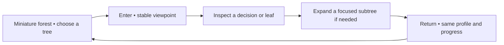

# Epic M5 — Navigate an understandable forest

[Backlog overview](../backlog.md) · [Diorama and immersion scenario](../experience-scenarios.md)

**Business description.** Give visitors a useful view of the entire model and a comfortable way to inspect its details. A miniature forest on a table helps them choose a tree; entering the tree reveals readable decisions. Returning restores their place. Depth, lighting, and atmosphere support understanding while dense branches can be summarized without changing the model result.

**Business value:** a coherent demonstration that visitors can navigate themselves, with a recognizable sense of place and a clear route back.

**Status:** implemented; combined Quest acceptance deferred by user. See [M5 implementation evidence](../m5-progress-2026-09-30.md). **Priority:** Must. **Dependencies:** accepted M4; visual exploration may begin during M3. **Owner role:** Unity presentation/UX developer. **Planning range:** 4–6 working days.

**Epic acceptance:** a visitor finds a tree, enters it, inspects a leaf, and returns with progress intact using controllers alone. Text and targets stay readable; scenery does not obscure model information.

## M5-01 — Select a tree from the forest overview

**User story:** As a visitor, I want a miniature forest that I can inspect and select so that I understand the model contains several ordered trees before entering one.

**Priority:** Must. **Status:** Implemented; headset acceptance pending. **Owner role:** Unity/UX developer. **Depends on:** M4-01, M4-08.

**Acceptance criteria**

1. Present the model as a bounded tabletop diorama with identifiable model trees, selection feedback, and a clear entry action.
2. Preserve canonical tree identities/order even when positions are arranged for readability. Decorations cannot be selected as model trees.
3. Allow controller rotation and bounded scaling of the model with discoverable reset/return controls and documented limits.
4. Scaling changes model presentation, not the user's tracking space, head pose, or controller reach assumptions. It cannot create surprise locomotion.
5. Selected tree, active profile/mode, and progress are understandable at overview scale without displaying every node label.
6. If geometry is summarized for a larger model, show what is represented and provide access to trees without removing them from evaluation.

**Evidence required:** selection/identity checks, bounds/reset tests, and a seated/standing Quest overview walkthrough with both small and larger synthetic models.

## M5-02 — Enter and return without losing progress

**User story:** As a visitor, I want to move between overview and detail and return to the same place so that I can explore without feeling lost or restarting my explanation.

**Priority:** Must. **Status:** Implemented; headset acceptance pending. **Owner role:** Application/XR developer. **Depends on:** M5-01, M4-08, M3-06.

**Acceptance criteria**

1. “Enter tree” performs a deliberate transition to a stable viewpoint associated with the selected tree and current node.
2. “Return to forest” restores the overview selection/orientation or documented return view while retaining profile copy, mode, route, node, score, and pause state.
3. Both scales share one accepted session; entering/exiting cannot commit another leaf, reset the evaluation, or produce two competing playback controllers.
4. Returning during animation or paused playback resolves to a coherent state. Resume at either scale does not process stale transition events.
5. Head tracking remains independent of the transition. Provide a clear return landmark and no forced head rotation.
6. Explicit Restart remains distinct from Return and makes its state reset clear to the visitor.

**Evidence required:** deterministic session preservation tests across root/split/leaf/final states and repeated Quest enter/return cycles with unchanged totals.

## M5-03 — Make tree depth readable and navigable

**User story:** As a visitor, I want to see which branches belong to each decision so that spatial complexity does not hide the explanation.

**Priority:** Must. **Status:** Implemented; headset acceptance pending. **Owner role:** Unity layout/UX developer. **Depends on:** M3-01, M5-02.

**Acceptance criteria**

1. Lay out trees so parent-child direction, current path, and the next available choices remain clear in three dimensions.
2. Prevent important labels and selection targets from overlapping or being hidden by platforms, branches, panels, or decoration at intended observation positions.
3. Establish and record seated/standing reading positions, label sizes/distances, and dense/deep-tree test cases before acceptance.
4. Use text or shape with color to distinguish branch conditions, active route, and signed contribution. Do not reuse one color meaning for unrelated quantities.
5. Offer a focused view or deliberate viewpoint adjustment when depth would otherwise require prolonged upward gaze or unsafe physical movement.
6. Preserve stable model IDs through relayout; moving a visible node cannot change its condition, selected leaf, or contribution.

**Evidence required:** layout/identity checks and headset readability observations for the seven-node fixture and agreed dense/deep synthetic cases. Desktop screenshots alone do not certify text legibility.

## M5-04 — Summarize dense subtrees without hiding model truth

**User story:** As a visitor inspecting a large tree, I want a focused neighborhood and clear summaries so that I can read the relevant decisions without losing the context of what is hidden.

**Priority:** Must. **Status:** Implemented; headset acceptance pending. **Owner role:** Unity presentation developer. **Depends on:** M5-03, M2-04, M4-07.

**Acceptance criteria**

1. Collapse detail according to an explicit visual budget while retaining the complete underlying model and authoritative evaluation.
2. Each collapsed branch retains its stable identity and an accurate count of hidden nodes; the visitor can distinguish a summary from a terminal leaf.
3. Selecting a summary opens an enlarged/focused subtree with a visible connection to its original location and a clear way back.
4. The active profile path and selected node remain discoverable when outside the current neighborhood. Expansion/closure cannot add or remove score events.
5. Recalculate summary counts and focus state consistently after model/view changes; stale counts or references produce a diagnosable state rather than selecting another node.
6. Large-model tests show the same full score before and after collapse, expansion, relayout, and tree switches. Rendering limits never become scorer limits.

**Evidence required:** summary-count/identity checks, full-score equality tests, and headset interaction with the agreed worst visible neighborhood.

## M5-05 — Build atmosphere that supports understanding

**User story:** As a visitor, I want a coherent twilight forest with clear landmarks so that the experience feels engaging while decisions and controls remain easy to see.

**Priority:** Must. **Status:** Implemented; headset acceptance pending. **Owner role:** Environment/technical artist. **Depends on:** M3-01 for early work; M5-03 for final acceptance.

**Acceptance criteria**

1. Integrate a coherent set of URP-compatible materials, restrained lighting, distant scenery, luminous paths, and quiet spatial audio around the functional experience.
2. Prioritize silhouette, orientation landmarks, foreground text, and active targets before decorative effects such as mist/fireflies/glow.
3. Distinguish decorative scenery from model-bearing trees and information cues; atmosphere must not imply unsupported audit findings or predictive importance.
4. Audio reinforces location or interaction without being the sole carrier of an essential instruction. The demo remains understandable without relying on hearing a cue.
5. Decorative movement stays away from decision text and does not trigger discomfort or interfere with controller target selection.
6. Check the integrated environment on Quest early and feed measured costs into M6; Editor frame rate is not evidence of headset readiness.

**Evidence required:** visual/audio design review, asset inventory reference, and headset readability/orientation observations with the final effects enabled.

## M5-06 — Preserve asset provenance and permission to use it

**User story:** As the demonstration owner, I want the origin and permitted use of every external asset recorded so that the team can share the final build with confidence.

**Priority:** Must for all introduced external assets. **Status:** Provenance register implemented; final release asset/notice review pending. **Owner role:** Content/project maintainer. **Depends on:** assets chosen in M1–M5; complete before M6-07.

**Acceptance criteria**

1. Maintain an asset register covering models, textures, fonts, materials, audio, icons, samples, and other external content actually included in the project/build.
2. Record source/creator, exact asset/package version where applicable, license evidence/location, intended use, and any attribution or redistribution conditions.
3. Distinguish original project content, package samples, generated assets, and third-party licensed content; do not invent missing rights or attribution.
4. Resolve unknown or incompatible terms before including the affected asset in the demo package. Substitute approved content when rights cannot be established.
5. Keep proof and required credits organized without placing account credentials or purchase details in public/tracked output.
6. Review the final build's included assets, not only the working folder, so unused exploratory downloads do not obscure what must be credited.

**Evidence required:** reviewed provenance register and required credits alongside the build/package scope. Any legal interpretation needing clarification is recorded as unresolved rather than asserted.

## M5-07 — Onboard visitors and keep recovery visible

**User story:** As a visitor new to VR and boosted trees, I want a short introduction and always-reachable recovery controls so that I can use the demonstration without a keyboard operator.

**Priority:** Must. **Status:** Implemented; headset acceptance pending. **Owner role:** UX/application developer. **Depends on:** M5-01–M5-05, M4-08.

**Acceptance criteria**

1. Introduce pointing/selecting, mode choice, reading a condition, and return/recovery using a short practical sequence rather than a long technical tutorial.
2. Explain manual exploration versus prepared-profile playback before their results can be confused; show synthetic provenance in appropriate plain language.
3. Offer seated/standing use and make Pause, Back, Restart, and Return to forest visibly available from each relevant state and scale.
4. Visitors can skip/revisit onboarding according to a clear local policy; skipping must not remove access to essential controls or the legend.
5. Recovery from an unfamiliar view or a mistaken selection is possible with controllers alone and preserves progress except on explicit restart.
6. Observe a visitor completing forest selection, entry, leaf inspection, and return without presenter keyboard help. Record confusion and fix blocking issues before the epic is accepted.

**Evidence required:** onboarding/recovery state checklist and headset observation showing the complete controller-only M5 journey. The larger three-person comprehension study follows in M6.

## Development-plan coverage

| Original M5 item | Stories |
| --- | --- |
| Overview, selection, bounded scaling, entry/return | M5-01, M5-02 |
| Preserve profile/path/node across scale | M5-02 |
| Readable depth and occlusion | M5-03 |
| Collapsed summaries and focused view | M5-04 |
| Materials, lighting, scenery and audio | M5-05 |
| Licenses and provenance | M5-06 |
| Onboarding and recovery controls | M5-07 |
