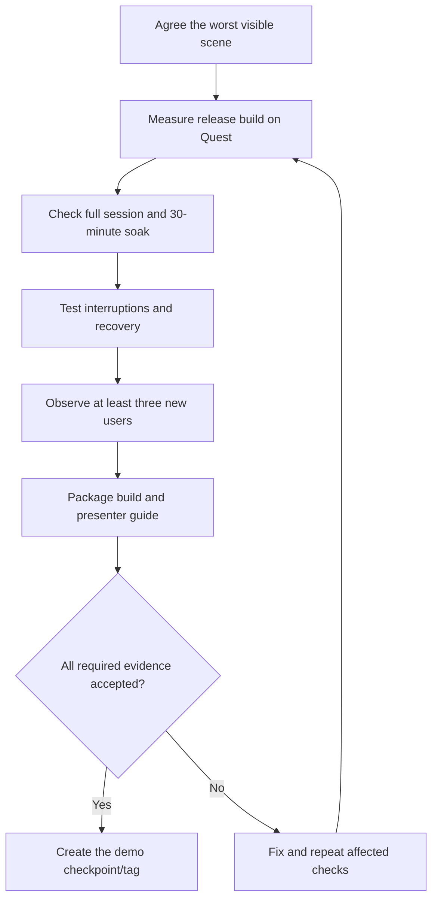

# Epic M6 — A demonstration ready for an audience

[Backlog overview](../backlog.md) · [Acceptance matrix](../testing.md)

**Business description.** Turn a working prototype into a demonstration a presenter can rely on. Prove that it remains smooth and understandable on the actual Quest during realistic sessions, handles interruptions safely, and can be installed and operated from clear instructions. The release claim is based on recorded results rather than how fast the Editor looks.

**Business value:** a credible audience experience with known operating conditions, fewer live-demo failures, and a reproducible build.

**Status:** in progress. On September 30, 2026 the user added all twelve in-world explanation stories below. Hardware acceptance remains deferred; no headset performance evidence exists. **Priority:** Must, with casting conditional. **Dependencies:** accepted M5 and preceding synthetic gates; G2R only if real-model prediction claims are included. **Owner role:** Release/QA owner. **Planning range:** 4–6 working days.

The return arrow means repeat checks affected by a fix, not rerun every unrelated test automatically.

**Epic acceptance:** all blocking Quest acceptance items pass, release performance is evidenced at the agreed workload, a 30-minute soak and comprehension study are recorded, and the presenter can install/run the exact accepted build. A missing test is not a pass.

## M6-01 — Define and measure the real headset workload

**User story:** As a demonstration owner, I want performance measured under representative and demanding conditions so that the team's readiness claim reflects what visitors will actually see.

**Priority:** Must. **Status:** Not started. **Owner role:** Performance/QA engineer. **Depends on:** M5-03–M5-05, M4-07.

**Acceptance criteria**

1. Agree and record a worst visible scene including model size, active trees/nodes, label counts, effects, scale, profile, and tour state. Include a large-model case with bounded visible detail.
2. Define the tested scenarios and measurement windows before acceptance: overview, immersive detail, transitions, profile editing, and the full demonstration route.
3. Use a standalone release build on Quest 3 without script debugging for final evidence. Record build/source identity, headset OS, display rate, graphics mode, and relevant conditions.
4. Measure CPU and GPU frame times, native rendering rate, dropped frames, and memory using appropriate device tools and focused profiling.
5. Keep Editor/Simulator measurements clearly separate from hardware results. Explain instrumentation overhead where a profiler changes performance.
6. Store detailed logs locally in ignored artifacts and summarize reproducible conditions/results without device identifiers.

**Evidence required:** agreed workload specification and actual device measurement captures. No synthetic benchmark or desktop FPS substitutes for this story's evidence.

## M6-02 — Sustain the agreed performance target without changing the model

**User story:** As a visitor, I want a smooth explanation even in the busiest supported scene so that I can focus on the model instead of stuttering or discomfort.

**Priority:** Must. **Status:** Not started. **Owner role:** Performance/Unity developer. **Depends on:** M6-01.

**Acceptance criteria**

1. Meet the project's sustained native 72 FPS rendering target with a 72 Hz display under the agreed workload, with CPU/GPU timing and dropped-frame evidence across the agreed windows.
2. Use approximately 13.9 ms per frame as the 72 Hz interval and retain useful headroom; report spikes and drops rather than hiding them in one average. Define any accepted transient exceptions before claiming a pass.
3. Optimize measured bottlenecks in visibility, labels, materials, lighting, allocation, and effects while retaining required readability and interaction responsiveness.
4. Never reduce the evaluated ensemble or alter numerical results to meet a rendering budget. Larger-model full-score regression checks continue to pass after optimization.
5. Verify memory behavior and transition/profile-edit costs, not only a stationary scene; no persistent performance collapse is acceptable.
6. Assess 90 Hz only after the 72 Hz baseline is stable and useful margin exists. It is optional and must not delay or weaken the baseline acceptance.

**Evidence required:** before/after device measurements for actual changes, accepted workload results, and semantic/visual regression evidence affected by those changes.

## M6-03 — Remain reliable for the whole presentation and a soak session

**User story:** As a presenter, I want the application to remain correct throughout repeated tours so that a longer audience session does not accumulate state or stability problems.

**Priority:** Must. **Status:** Not started. **Owner role:** QA tester. **Depends on:** M6-02, M4-08, M5-07.

**Acceptance criteria**

1. Run the complete planned presentation route on Quest and at least one uninterrupted 30-minute application soak with a recorded scenario sequence.
2. Exercise both modes, replay, undo/restart, profile changes/edits, overview/immersion switching, and short/detailed tours during the session.
3. Check reference scores and selected routes at planned checkpoints; no accumulated contribution, stale highlight, or unrecoverable session divergence is allowed.
4. Capture crashes, exceptions, memory trends, frame-time deterioration, and controller/interaction failures. Distinguish device/system interruptions from application behavior.
5. After the soak, restart the application and verify it still reaches the expected bundled demo state.
6. A failure includes reproducible steps and severity; repeat the affected scenario and sufficient duration after the fix rather than relabeling the original run as passed.

**Evidence required:** dated 30-minute-plus test record, build/profile/scenario identifiers, performance observations, and disposition of detected failures.

## M6-04 — Recover safely from real-world interruptions

**User story:** As a visitor, I want the experience to pause and recover predictably when I remove the headset, recenter, or lose tracking so that I can continue without confusion or corrupted results.

**Priority:** Must. **Status:** Not started. **Owner role:** XR/QA tester. **Depends on:** M5-07, M4-08; accepted release candidate configuration.

**Acceptance criteria**

1. Exercise opening the system menu, removing/replacing the headset, controller tracking loss/restoration, and head tracking loss/restoration in representative session states.
2. Pause presentation safely when appropriate; restore tracked control and clear user feedback before continuing. Do not force the viewer's head pose or skip unseen decisions.
3. Preserve or explicitly reset session state according to the documented recovery policy; contributions and route state must never duplicate or silently mix.
4. Recenter and change seated position, then verify controls, text, return point, and safe viewpoint remain usable.
5. Test fresh install, a compatible signed update, normal fresh launch, and offline relaunch using bundled data. Confirm intended application version and no dependency on a connected Mac.
6. Failed update/signature recovery must not automatically uninstall user data. Document the limitation and required manual action if applicable.
7. Verify both controller inputs, manual/profile mode, selected profile, and final score after recovery, including interruption during animation or an edit.

**Evidence required:** completed installation/tracking/recovery/recenter/offline rows of the Quest acceptance matrix with expected/actual outcomes and build identity.

## M6-05 — Prove the explanation works for new users

**User story:** As a business sponsor, I want people unfamiliar with the controls to understand the experience so that a polished scene is not mistaken for a successful explanation.

**Priority:** Must. **Status:** Not started. **Owner role:** UX researcher/tester. **Depends on:** M5-07 and a stable release candidate.

**Acceptance criteria**

1. Observe at least three people unfamiliar with the controls completing the first-session route without keyboard assistance; record actual presenter prompts and interventions.
2. Include selecting a branch, reaching and undoing a leaf, identifying the current tree, following a prepared profile, and returning to the forest.
3. Ask each participant to explain why the profile chose a branch and distinguish a leaf contribution, route score, and final profile probability in their own words.
4. Observe readability at intended seated/standing positions, recovery discoverability, orientation, and comfort; do not rely only on a satisfaction score.
5. Record anonymized task outcomes, confusion, navigation errors, assistance, and improvement actions. Avoid collecting unnecessary personal data.
6. Turn blocking comprehension/navigation failures into implementation work, retest affected tasks, and report what remains unresolved. Three participants alone is not automatic acceptance.

**Evidence required:** study script, anonymized observations for at least three new users, issue dispositions, and retest notes supporting the comprehension gate.

## M6-06 — Validate casting if the presentation needs it

**User story:** As a presenter showing the experience to an audience, I want casting tested separately so that the audience view does not unexpectedly degrade the visitor's experience.

**Priority:** Conditional on casting being included in the demonstration. **Status:** Not started; requirement to be decided. **Owner role:** Demo/QA owner. **Depends on:** M6-01–M6-03 and available casting setup.

**Acceptance criteria**

1. Record whether casting is required. If excluded, mark this story not applicable with that decision; do not claim casting was tested.
2. If included, specify the intended receiver, connection, and presentation conditions, then rehearse the actual demo route while casting.
3. Measure headset performance separately with and without casting and record any material effect on the accepted 72 Hz experience.
4. Check that audience-visible labels, mode/profile identity, and explanations remain usable; capture limitations in viewpoint or readability.
5. Test losing/reconnecting the audience view without corrupting the visitor's session or requiring an unsafe interruption.
6. Document a fallback presentation method and operational steps for a casting failure. Network requirements belong to casting, not the offline core demo.

**Evidence required:** explicit scope decision or a casting rehearsal/measurement record and presenter instructions. A non-casting performance pass does not automatically accept casting.

## M6-07 — Deliver a reproducible APK and presenter guide

**User story:** As a presenter, I want one clearly identified build and a short guide so that I can install, start, explain, and recover the demonstration without developer improvisation.

**Priority:** Must. **Status:** Not started. **Owner role:** Release maintainer and presenter. **Depends on:** M5-06, M6-02–M6-05; M6-06 if casting is required.

**Acceptance criteria**

1. Produce a clearly named APK with app version, source commit, build date/type, supported headset, and selected synthetic model/profile identifiers recorded in a release manifest.
2. Record the exact package/settings/toolchain combination and installation/update procedure; keep APKs and detailed logs under ignored artifacts or an explicitly agreed distribution location.
3. Provide a concise guide covering prerequisites, launch, mode/profile selection, the recommended route, Pause/Back/Restart/Return, offline operation, and shutdown/relaunch.
4. Include common operational failures and concrete recovery steps, plus known limitations and casting setup/fallback if relevant.
5. State that bundled examples are synthetic. Include real-model claims only for the exact scope accepted by G2R and include required asset credits.
6. Have a presenter follow the guide on Quest using the delivered APK; verify version identity and perform the intended explanation without undocumented keyboard steps.
7. Keep signing credentials, private model data, and device/account identifiers out of the distributable/tracked documents. Publishing to a store or public remote is not implied.

**Evidence required:** APK identity/checksum record, release manifest, reviewed presenter guide, asset credits, and an installation/rehearsal result using that exact artifact.

## M6-08 — Accept and tag only the demonstrated result

**User story:** As the project owner, I want an evidence-based release checkpoint so that “demo ready” has a clear meaning and can be reproduced later.

**Priority:** Must. **Status:** Not started. **Owner role:** Release/product owner. **Depends on:** M6-01–M6-07, with conditional items resolved; prior epic gates.

**Acceptance criteria**

1. Review every applicable row of `docs/testing.md`: installation, tracking, manual route, prepared profile, takeover, full ensemble, scale, text, recovery, recenter, offline use, duration, and casting if required.
2. Require accepted full-model synthetic results, target-device performance, the duration/soak run, and new-user comprehension evidence for the exact release candidate or a justified unchanged scope.
3. Classify each result pass/fail/not tested/not applicable with a reason. Open blocking failures or untested mandatory behavior prevent acceptance.
4. Non-blocking limitations are recorded with impact, owner, and operational workaround; acceptance does not conceal them from the presenter.
5. Create a clearly named demo tag only after acceptance and link it to the source commit, APK identity, toolchain record, and evidence summary.
6. Keep APKs outside ordinary Git history, retain private logs locally, and do not publish a remote/store release without its own explicit distribution decision.
7. For any subsequent change, identify the affected acceptance rows and rerun them before replacing the accepted artifact/tag record.

**Evidence required:** reviewed release checklist, tagged source identity, artifact manifest, and a self-contained acceptance summary that states exactly what was tested.

## Development-plan coverage

| Original M6 item | Stories |
| --- | --- |
| CPU/GPU/frame/memory profiling on release hardware | M6-01 |
| Sustained 72 FPS at 72 Hz; optional 90 Hz | M6-02 |
| Full presentation and 30-minute soak | M6-03 |
| Removal, pause/resume, tracking loss, recenter, launch | M6-04 |
| At least three new users | M6-05 |
| Separate casting test if needed | M6-06 |
| Named APK, version/commit, presenter guide | M6-07 |
| Tag after acceptance; APK outside Git | M6-08 |

## Added in-world explanation scope — approved September 30, 2026

These stories extend M6; they do not replace M6-01–M6-08 or close hardware acceptance. Content is English. Short labels are visible in the world; pointing reveals longer evidence with no menu prerequisite. Every metric uses the full accepted model, and inspection cannot mutate routes, tracking or evaluation.

### M6-09 — Readable node questions

**Status:** Implemented; Editor verification recorded in the [M6 implementation record](../m6-in-world-explanations-2026-09-30.md), Quest acceptance pending. **Acceptance:** Show the declared label, operand type and supplied unit. For a prepared profile show its actual value and evaluated result; unknown units remain explicitly unavailable.

**Evidence:** deterministic synthetic checks, Editor interaction/layout verification, then the deferred seated/standing Quest walkthrough.

### M6-10 — Explain each branch

**Status:** Implemented; Editor verification recorded in the [M6 implementation record](../m6-in-world-explanations-2026-09-30.md), Quest acceptance pending. **Acceptance:** Label both outgoing alternatives and the selected-profile reason. Reveal complete membership sets by pointing, without opening a menu.

**Evidence:** deterministic synthetic checks, Editor interaction/layout verification, then the deferred seated/standing Quest walkthrough.

### M6-11 — Accumulated segment portrait

**Status:** Implemented; Editor verification recorded in the [M6 implementation record](../m6-in-world-explanations-2026-09-30.md), Quest acceptance pending. **Acceptance:** Show the conditions leading to the inspected node, merge numeric bounds and flag contradictory accepted choices beside the affected feature. Preserve route state.

**Evidence:** deterministic synthetic checks, Editor interaction/layout verification, then the deferred seated/standing Quest walkthrough.

### M6-12 — Local split significance

**Status:** Implemented; Editor verification recorded in the [M6 implementation record](../m6-in-world-explanations-2026-09-30.md), Quest acceptance pending. **Acceptance:** On pointing show stored gain, its share of tree gain and predictor reuse. Missing or nonpositive denominators cannot produce invented shares; gain is not SHAP or causality.

**Evidence:** deterministic synthetic checks, Editor interaction/layout verification, then the deferred seated/standing Quest walkthrough.

### M6-13 — Node observation evidence

**Status:** Implemented; Editor verification recorded in the [M6 implementation record](../m6-in-world-explanations-2026-09-30.md), Quest acceptance pending. **Acceptance:** Show exported sampleCount and an explicit, neutral low-count review convention. Never convert counts into traffic shares, branch positives or unverified node ages.

**Evidence:** deterministic synthetic checks, Editor interaction/layout verification, then the deferred seated/standing Quest walkthrough.

### M6-14 — Leaf explanation

**Status:** Implemented; Editor verification recorded in the [M6 implementation record](../m6-in-world-explanations-2026-09-30.md), Quest acceptance pending. **Acceptance:** Connect the segment, leaf contribution and accepted before/after subtotal. Show the complete result only for supported prepared profiles; never derive probability from an internal node.

**Evidence:** deterministic synthetic checks, Editor interaction/layout verification, then the deferred seated/standing Quest walkthrough.

### M6-15 — Crown passport

**Status:** Implemented; Editor verification recorded in the [M6 implementation record](../m6-in-world-explanations-2026-09-30.md), Quest acceptance pending. **Acceptance:** Show stable tree identity/order, depth, leaves, frequent predictors, ensemble gain share and leaf contribution bounds. Summarize the root question from actual structure.

**Evidence:** deterministic synthetic checks, Editor interaction/layout verification, then the deferred seated/standing Quest walkthrough.

### M6-16 — Visible tree composition

**Status:** Implemented; Editor verification recorded in the [M6 implementation record](../m6-in-world-explanations-2026-09-30.md), Quest acceptance pending. **Acceptance:** Preserve depth/leaf geometry and signed-contribution rings. Add a separate labelled family strip based on stored split gain, with explicit unavailable/zero states.

**Evidence:** deterministic synthetic checks, Editor interaction/layout verification, then the deferred seated/standing Quest walkthrough.

### M6-17 — Point-driven predictor links

**Status:** Implemented; Editor verification recorded in the [M6 implementation record](../m6-in-world-explanations-2026-09-30.md), Quest acceptance pending. **Acceptance:** After pointing at a predictor, highlight exact-identifier matches across visible nodes and garden crowns with accurate full-model counts, without changing evaluation.

**Evidence:** deterministic synthetic checks, Editor interaction/layout verification, then the deferred seated/standing Quest walkthrough.

### M6-18 — Numeric threshold spectrum

**Status:** Implemented; Editor verification recorded in the [M6 implementation record](../m6-in-world-explanations-2026-09-30.md), Quest acceptance pending. **Acceptance:** Show current and ensemble cutpoints near numeric nodes, with exact values available on pointing. Do not call these values a proven memory horizon.

**Evidence:** deterministic synthetic checks, Editor interaction/layout verification, then the deferred seated/standing Quest walkthrough.

### M6-19 — Explicit missing-data paths

**Status:** Implemented; Editor verification recorded in the [M6 implementation record](../m6-in-world-explanations-2026-09-30.md), Quest acceptance pending. **Acceptance:** Mark actual IsMissing nodes and the prepared-profile route. Do not equate absent history with a new customer or invent unknown-category routing.

**Evidence:** deterministic synthetic checks, Editor interaction/layout verification, then the deferred seated/standing Quest walkthrough.

### M6-20 — Entrance model story

**Status:** Implemented; Editor verification recorded in the [M6 implementation record](../m6-in-world-explanations-2026-09-30.md), Quest acceptance pending. **Acceptance:** Display supplied version/update, model/feature counts, monitoring counts and a factual structural summary near the entrance. Distinguish missing evidence and preserve export order; infer no dated drift events.

**Evidence:** deterministic synthetic checks, Editor interaction/layout verification, then the deferred seated/standing Quest walkthrough.
