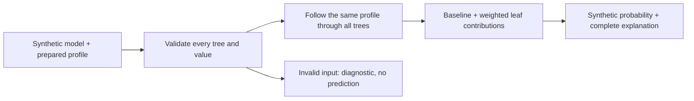

# M2 synthetic model foundation — implementation and verification

Date: 2026-09-28. Stories: **M2-01 through M2-05 implemented and verified in Unity EditMode**. The synthetic logic gate passes in the pinned Editor. M1 device qualification remains open; this record does not accept M1 or the complete M2 real-model track.

## Delivered behavior

The explanation engine loads a normalized model and prepared profiles, validates them, follows the profile through every tree in canonical order, and returns an immutable explanation. Each decision includes the original feature value, condition, Boolean result, and selected child. Each tree includes its complete path, leaf score, weight, effective contribution, and running total. The final result retains the baseline, raw score, and stable sigmoid probability.

Invalid inputs produce diagnostics and no result. An invalid final tree invalidates the entire prediction; a failed call cannot return an earlier successful result. Diagnostics carry structural identifiers or JSON locations without including profile values in error messages. Successful decision traces intentionally contain observed values for the explanation UI and must not be indiscriminately logged when private inputs are introduced.



This is the calculation foundation; there is no new forest scene or interactive playback yet. Manual branch exploration remains a separate application-layer feature and has no API that can turn arbitrary branch choices into a prepared-profile probability. Hands, rig tracking, and future M3–M5 navigation are unchanged by this implementation.

## Code and boundaries

| Assembly | Location under `BoostingExperience/Assets/VRExperienceAGB/` | Responsibility |
| --- | --- | --- |
| `VRExperienceAGB.Domain` | `Runtime/Domain/` | Immutable data, validation, exact decisions, complete ensemble scoring |
| `VRExperienceAGB.Import` | `Runtime/Import/` | Normalized synthetic JSON v1 reader/writer; not an AGB export adapter |
| `VRExperienceAGB.Domain.Tests` | `Tests/EditMode/` | Independent fixture comparisons and negative/boundary tests |

Both runtime assemblies set `noEngineReferences`; tests inspect their actual compiled references and confirm they do not reference Unity or XR. The domain assembly also has no JSON dependency. `com.unity.nuget.newtonsoft-json` **3.2.2**, already installed transitively, is now an explicit direct dependency at the same version. Unity generated the updated package manifest/lock and metadata; no project settings or scenes changed in this slice.

The reader rejects unknown schema fields, duplicate JSON properties, missing mandatory scoring fields, unsupported versions/types/operators, model-ID mismatches, invalid graph structure, undeclared categories, and invalid numeric values. Optional numeric constraints have their declared meaning; baseline, tree weights, leaf scores, missing policies, and operator operands are mandatory. A missing numeric value requires an explicit missing guard on the visited route and is never converted to zero or false. JSON nesting is limited to 128; exceeding the parser limit rejects the input and never truncates trees. Tree topology is validated and traversed iteratively.

Results always declare `IsSourceModelVerified == false`. Unknown objectives and additional calibration/scaling fields are rejected. The normalized binary-logistic formula is qualified only by the synthetic evidence below.

## API usage

```csharp
var modelInput = NormalizedModelJson.ReadModel(modelJson);
if (!modelInput.IsSuccess) { ShowDiagnostics(modelInput.Diagnostics); return; }

var profilesInput = NormalizedModelJson.ReadProfiles(profilesJson, modelInput.Value);
if (!profilesInput.IsSuccess) { ShowDiagnostics(profilesInput.Diagnostics); return; }

var evaluation = ModelEvaluator.Evaluate(modelInput.Value, profilesInput.Value.Profiles[0]);
if (!evaluation.IsSuccess) { ShowDiagnostics(evaluation.Diagnostics); return; }
ShowSyntheticExplanation(evaluation.Value);
```

`ShowDiagnostics` and `ShowSyntheticExplanation` are illustrative consumer callbacks, not implemented scene functions. A consumer must replace its state from the current outcome and clear or visibly invalidate prior output on failure. Use `PreparedProfile.WithValue` for an independent edit. `ProfileValue.Missing` and `ProfileValue.NotSupplied` retain distinct identities. Evaluation accepts no visible-tree selection, tour length, or render budget; consumers select views from the complete result.

## Observed verification

- Unity **6000.6.3f1** live Editor compilation completed: no errors, `compilationFailed: false`.
- Unity Test Framework **1.8.0**, assembly `VRExperienceAGB.Domain.Tests`, EditMode: **84 passed, 0 failed, 0 skipped, 0 inconclusive**. Reported suite duration: 1.87 seconds; this is not a device performance measurement.
- All four checked-in reference cases matched every path, leaf, contribution, raw score, and probability. Expected files were read directly from `data/examples/` and were not changed or generated from the C# implementation.
- Additional tests cover immutable copies and JSON round trips; strict thresholds 5 and 100; exact category membership/case; absent/null values; missing guards; same original profile across trees; malformed graph/data rejection; late failure with no partial or stale result; non-unit, zero and negative weights; a 257-tree ensemble; a 4,096-decision path; non-finite inputs; arithmetic overflow; and sigmoid scores ±1,000.
- Runtime assembly independence and stable IDs despite duplicate display labels passed.
- `python3 scripts/verify-examples.py` passed as an independent supplementary fixture check. Its console warning about unverified Unity is the verifier's scope statement; it does not inspect this separate C# test run.
- All ten new source/assembly-definition files have Unity-generated `.meta` files.

| Profile | Raw score | Synthetic probability |
| --- | ---: | ---: |
| New visitor | -2.2 | 0.09975048911968513 |
| Returning visitor | -0.7 | 0.3318122278318339 |
| Engaged visitor | -0.1 | 0.47502081252106 |
| Exact threshold values | -1.0 | 0.2689414213699951 |

Absolute numeric comparison tolerance is `1e-12`, independent of presentation rounding.

The full per-test report is local and ignored: `artifacts/m2-foundation-2026-09-28/editmode-results.json`. SHA-256: `762cf94825ed02489554358424961fbdb4024d9383e7c7e58b421f47f5c45be4`. Source/package/fixture hashes are saved alongside it in `source-hashes.json`. The tracked test suite and original expected fixtures provide reproducible evidence after checkout.

## Reproduce

Open `BoostingExperience/` in Unity 6000.6.3f1, allow compilation, open Test Runner, select EditMode, and run the `VRExperienceAGB.Domain.Tests` assembly. Keep the parent repository layout intact: tests load `../../data/examples` relative to `Application.dataPath`.

With the connected Editor and Unity CLI:

```sh
unity command --caller plugin --skill unity-cli run_tests \
  --mode editor --filter VRExperienceAGB.Domain.Tests --filter_type assembly \
  --async_tests true --project-path "$PWD/BoostingExperience" --format json
unity command --caller plugin --skill unity-cli test_status \
  --project-path "$PWD/BoostingExperience" --format json
```

Poll the second command until the status is `completed`; starting an asynchronous run is not a passing result.

## Remaining work

- M2-06–M2-08: actual AGB export grammar, adapter, authoritative source predictions, and verification gate. No real-model correctness claim is supported yet.
- M3 and M4: application session, manual exploration, undo, prepared-profile playback, presentation state invalidation, scene integration, and bundled runtime data loading. Tests currently load repository fixtures; they are not yet bundled into the APK.
- Actual presentation selections/tour budgets still need integration tests in M4. The current API excludes those inputs and the 257-tree test verifies full scoring; it does not claim a scene selection was exercised.
- Quest/IL2CPP execution of the new evaluator, headset interaction, comfort, readability, and performance remain untested. The earlier D10 APK predates this implementation and is not evidence for it.
- D06 and other deferred setup checks retain their existing status. The selected pure-C# work does not resolve them.
